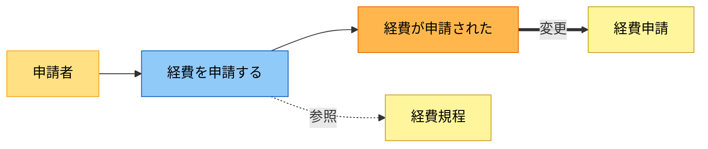
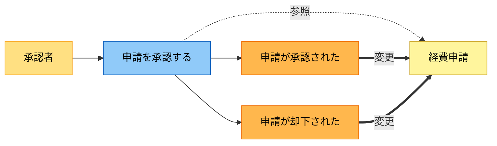
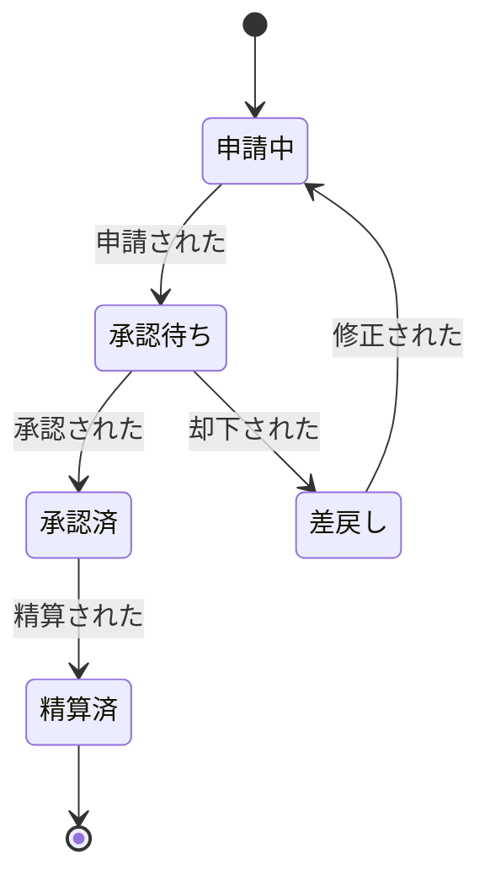

# analysis.md 雛形

`rdra/analysis.md` の構成と書き方を、経費精算を例に示す。実際の `analysis.md` を作るときは、この章立てを使い、例文は対象の要求に合わせて書き換える。サマリは表、詳細はネストした箇条書き、業務はイベントモデリング図、状態は状態遷移図で表す。

各業務には次の2つを必ず添える。図だけでは伝わらない、現実の文脈と具体的な変更内容を言葉で残すため。

- **シーン** — その業務が現実のどんな場面で、なぜ起きるか。利用者が情景を思い浮かべられる粒度で書く
- **変更の詳細** — 図に表れない具体的な変更内容。どのエンティティの、どんな情報が、どんな値で作られ・変わるか。業務ルールや既知の制約もここに書く

以下の `----8<----` から下が、`analysis.md` に入れる中身の例。

----8<----

# 経費精算 要求分析

## 1. アクター・外部システム

| 区分 | 名前 | 役割 |
| --- | --- | --- |
| アクター | 申請者 | 経費を申請する社員 |
| アクター | 承認者 | 申請内容を確認し承認・却下する上長 |
| アクター | 経理担当 | 精算を実行し記録する |
| 外部システム | 会計システム | 精算結果を仕訳として受け取る |
| 外部システム | 通知サービス | 承認依頼や結果を関係者へ通知する |

- 申請者
  - 経費を申請し、差し戻されたら修正する
  - 自分の申請状況を確認する
- 承認者
  - 申請を承認、または理由を添えて却下する
- 経理担当
  - 承認済みの申請を精算し、会計システムへ連携する

## 2. 領域（コンテキスト）

| 領域 | 扱う関心事 | 主なアクター |
| --- | --- | --- |
| 申請 | 経費の申請と修正 | 申請者 |
| 承認 | 申請内容の審査 | 承認者 |
| 精算 | 支払いと会計連携 | 経理担当 |

- 申請 — 経費を起票し、差し戻しに対応する範囲
- 承認 — 申請の妥当性を審査し、可否を決める範囲
- 精算 — 承認済みの申請を支払い、記録する範囲

## 3. 業務一覧

### 申請領域

#### 経費を申請する

**シーン**: 出張や備品購入で立て替えが発生し、申請者が精算を求めるとき。月末にまとめて申請することが多い。

- 発生するイベント
  - 経費が申請された
- 参照エンティティ
  - 経費規程
- 変更エンティティ
  - 経費申請

**変更の詳細**: 経費申請に、日付・科目・金額・領収書・申請者を記録し、状態を申請中にする。経費規程を参照して、上限超過や対象外の科目があれば申請時に気づけるようにする。

### 承認領域

#### 申請を承認する

**シーン**: 申請が上がってきたとき、承認者が内容を確かめて可否を決める。不備があれば理由を添えて差し戻す。

- 発生するイベント
  - 申請が承認された
  - 申請が却下された
- 参照エンティティ
  - 経費申請
  - 経費規程
- 変更エンティティ
  - 経費申請

**変更の詳細**: 経費申請の状態を、承認なら承認済、却下なら差戻しに変える。却下時は理由を残す。金額や科目そのものは変えず、状態と承認の記録だけを更新する。

## 4. 状態モデル

### 経費申請

## 5. 利用シーン

| シーン | 条件 | 概要 |
| --- | --- | --- |
| 通常の精算 | 規程内の金額 | 申請・承認・精算が一度で通る |
| 差し戻し | 不備あり | 却下され、修正して再申請する |
| 高額の申請 | 規程の上限超過 | 二段階の承認が必要になる |

- 差し戻し
  - 承認者が不備を理由に却下する
  - 申請者へ通知され、修正して再申請する
  - 再度、承認のフローに戻る
- 高額の申請
  - 一定金額を超えると、一次承認に加えて二次承認が要る
  - 二次承認者が承認するまで精算に進めない
