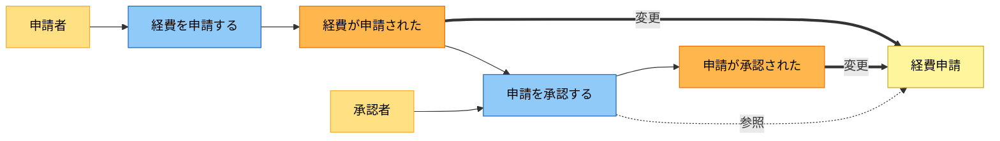
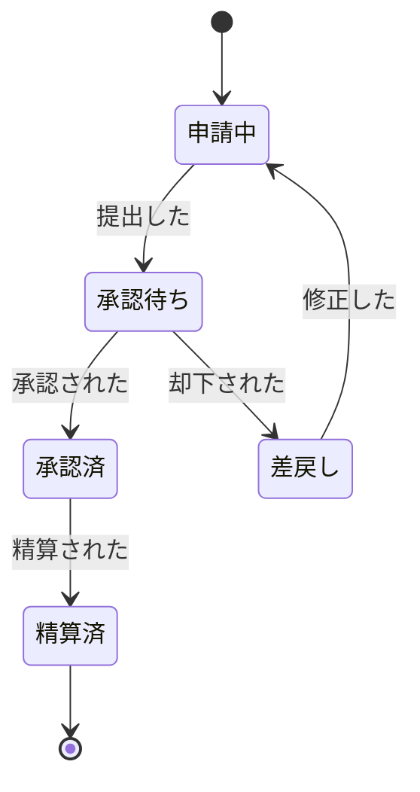

# Mermaid 記法規約

業務のイベントモデリング図と、エンティティの状態モデルは Mermaid で描く。見た目を全業務・全エンティティで揃えるため、次の規約に従う。

## イベントモデリング図

業務の流れを、イベントストーミングの流儀で表す。役割を色で区別する。

- **アクター**（黄）— 操作する人・役割
- **コマンド**（青）— アクターの操作・指示。「〜する」
- **ドメインイベント**（橙）— その結果起きた事実。「〜された」
- **エンティティ・集約**（薄黄）— 扱う情報のまとまり

矢印で参照・変更を区別する。

- アクター → コマンド → イベント は実線
- イベント -.参照.-> エンティティ は点線
- イベント ==変更==> エンティティ は太線

### 雛形

`flowchart LR` を基本にする。流れが長いときは `TB`（縦）にしてもよい。

### 書き方の注意

- ノード ID は `actor1` `cmd1` のように半角英数で付け、表示名は `["日本語ラベル"]` に入れる。日本語を ID に使わない
- ラベルに使うと崩れる記号（`()` `[]` `{}` `:` `;` など）は避けるか、ダブルクオートで囲んだラベル内に収める
- `classDef` の 4 行は毎回そのまま付ける。色を業務ごとに変えない
- 1 つの業務（または密接に関係する一連の流れ）につき 1 つの図にする。詰め込みすぎたら分割する

## 状態モデル

主要エンティティのライフサイクルは `stateDiagram-v2` で表す。状態を移すきっかけ（イベント）を矢印のラベルに書く。

### 書き方の注意

- `[*]` は開始と終了を表す。生まれる前と、役目を終えた後
- 矢印のラベルは、業務一覧で洗い出したイベントと言葉を揃える
- 状態名は短く、業務で使われている呼び方に合わせる
