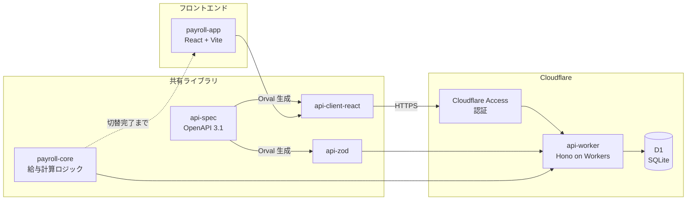

# Cloudflare Workers + D1 バックエンド構築計画書

- 作成日: 2026-06-12
- ステータス: 承認済み（認証方式・テナント分離の論点は 2026-06-12 に決着）

## 1. 背景と目的

PdM が Replit 上で給与管理システムのモックを開発しています。UI と給与計算ロジックはモック内に実装済みですが、バックエンドとインフラは未構築で、データはブラウザの localStorage に保持されています。

本計画書では以下の 2 点を定めます。

1. Cloudflare Workers をコンピューティング基盤、Cloudflare D1 をデータベースとするバックエンドの構築方針とタスク分解
2. PdM の Replit でのモック開発を止めずに、エンジニアが並行してバックエンドを開発するためのワークフロー

## 2. 現状整理

### 2.1 リポジトリ構成

pnpm workspaces によるモノレポです。バックエンドを見据えたスキャフォールドが既に存在します。

- `artifacts/payroll-app` — React 19 + Vite のフロントエンド。PdM が Replit で開発中
- `artifacts/mockup-sandbox` — UI コンポーネントの検証環境
- `artifacts/api-server` — Express 5 の骨格。`/api/healthz` のみ実装
- `lib/api-spec` — OpenAPI 3.1 仕様と Orval コード生成設定。health エンドポイントのみ定義
- `lib/api-client-react` — Orval 生成の TanStack Query クライアント（未使用）
- `lib/api-zod` — Orval 生成の Zod スキーマ
- `lib/db` — Drizzle ORM + PostgreSQL の接続層。スキーマ定義は空
- `scripts` — 開発補助スクリプト

### 2.2 モックのデータとロジック

- データ保持: `artifacts/payroll-app/src/lib/dummy-data.ts` の静的定数を初期値とし、変更分を localStorage に書き戻す二層構造
- 主要エンティティ: 従業員マスタ、契約・単価マスタ、給与確定スナップショット、賞与支給回、賞与確定スナップショット、タイムカード打刻、職場定義、手当
- API 通信: なし。`use-employees.ts` / `use-payroll.ts` がダミー定数に人工遅延を付けて返すだけ
- 給与計算ロジック: `artifacts/payroll-app/src/lib/` 配下に純粋関数として実装済み
  - `payroll-core/index.ts` の `computePayroll()` — 社会保険・所得税・住民税の一括計算
  - `payroll-core/bonus.ts` の `computeBonus()` — 賞与の保険料・源泉所得税計算
  - `taxCalculator.ts` / `bonusTaxCalculator.ts` — 源泉徴収税額
  - `constants/rates.ts` — 都道府県別・年度別の保険料率マスタ
  - `timeEngine.ts` — 打刻から労働時間バケットと割増賃金を算出
- テスト: なし。テストランナー自体が未導入

### 2.3 現状スキャフォールドと目標のギャップ

既存の `api-server` と `lib/db` は Express + PostgreSQL を前提にしており、Cloudflare Workers + D1 とは実行環境も DB 方言も異なります。ただし実装はほぼ空のため、転換コストは小さいです。

### 2.4 開発体制の現状

git ログを見ると、Replit Agent が master ブランチへ直接コミットしています。PdM は Replit 上で作業し、その成果が master に随時積まれる運用です。エンジニアが同じ master で作業すると、コンフリクトと事故の温床になります。

## 3. 技術方針

### 3.1 コンピューティング: Cloudflare Workers + Hono

新パッケージ `artifacts/api-worker` を作成し、Hono で API を実装します。既存の `artifacts/api-server`（Express）は触らず残置し、Workers 版が安定した時点で削除します。Express を Workers 向けに改造するより、Workers のデファクトである Hono で新規に書く方が確実です。

- ルーティング・ミドルウェア: Hono
- バリデーション: `lib/api-zod` の生成スキーマを流用（契約駆動を維持）
- ローカル開発: `wrangler dev`（ローカル D1 を含めてオフラインで動作）

### 3.2 データベース: Cloudflare D1 + Drizzle ORM

`lib/db` を PostgreSQL から D1（SQLite 方言）に転換します。スキーマ定義が現状空なので、破壊的変更にはなりません。

- スキーマ定義: Drizzle の `sqliteTable` で記述し、`drizzle-zod` で insert スキーマを生成
- マイグレーション: `drizzle-kit generate` で SQL を生成し、`wrangler d1 migrations apply` で適用
- D1 は SQLite ベースで、1 データベースの上限は Workers Paid プランで 10GB です。本システムのデータ量（従業員マスタ・月次スナップショット）では問題になりません

テナント分離はスコープ外と決定したため、単一テナント前提の単一 DB で設計します。DB スキーマと API 契約には `tenant_id` を持たせません。モックの `tenantId` はフロントエンド内部の localStorage キーの名前空間としてのみ残り、実 API への切替完了時にダミーデータごと削除します。

### 3.3 認証: Cloudflare Access

利用者は労務担当者のみと決定したため、認証は Cloudflare Access（Zero Trust）で行います。アプリケーション独自のログイン機能は実装しません。

- フロントエンドと API の手前に Access ポリシーを設定し、許可した労務担当者のみがアクセスできるようにします
- Workers 側では Access が付与する JWT（`Cf-Access-Jwt-Assertion` ヘッダー）を検証するミドルウェアを入れ、Access を経由しない直接アクセスを拒否します
- 給与データという機密性の高い情報を扱うため、Phase 4 で実データを投入する前に Access の保護を有効化します

### 3.4 契約駆動開発: OpenAPI を単一の合意点にする

`lib/api-spec/openapi.yaml` を API 契約の単一ソースとし、Orval で以下を生成する既存の仕組みをそのまま活かします。

- `lib/api-client-react` — フロントエンドが使う TanStack Query フック
- `lib/api-zod` — Workers 側のリクエスト/レスポンスバリデーション

この契約が PdM とエンジニアの分業の境界線になります。エンジニアは契約に対して実装し、PdM のモックは契約に合わせたデータ形状を維持する、という分担です。

### 3.5 給与計算ロジックの共有ライブラリ化

`artifacts/payroll-app/src/lib/` の純粋関数群（payroll-core、taxCalculator、rates、timeEngine 等）を新パッケージ `lib/payroll-core` へ抽出します。給与確定や賞与確定はサーバー側で計算して保存すべき処理であり、フロントとバックで計算ロジックが二重管理になると、料率改定のたびに不整合リスクが生じます。

抽出時のルール:

- payroll-app 側には re-export のシムを残し、PdM のコードの import 文を壊さない
- 移動は 1 つの機械的な PR にまとめ、着手タイミングを PdM と合わせる
- 抽出と同時に vitest でユニットテストを整備する（現在テストがゼロのため、移動前後の計算結果一致をテストで担保する）

### 3.6 サーバーサイドのコーディング規約

Workers 側の TypeScript は関数型ドメインモデリング（判別共用体・純粋な状態遷移・Result 型・境界での Zod 検証）に従います。給与データは個人情報の塊なので、ログへの PII 出力禁止を規約として明文化します。

### 3.7 テスト

- `lib/payroll-core`: vitest によるユニットテスト。税額表・料率の境界値を重点的に
- `artifacts/api-worker`: `@cloudflare/vitest-pool-workers` で D1 バインディング込みの統合テスト

## 4. 全体アーキテクチャ

OpenAPI 仕様から Orval がフロントエンド用クライアントとサーバー用バリデーションを生成し、フロントエンドは生成クライアント経由で Workers 上の API を呼び、Workers が D1 に永続化する構成です。API への通信は Cloudflare Access の認証を通過したものだけが Workers に届きます。給与計算ロジックは共有ライブラリとして Workers から使い、API への切替が完了するまでの間はフロントエンドからも参照します。

## 5. 並行開発ワークフロー

### 5.1 前提と原則

Replit Agent は master へ直接コミットします。この挙動は変えられない前提で、以下の原則を置きます。

1. **ディレクトリ所有権の分離** — 同じファイルを両者が触らなければコンフリクトは起きない
2. **契約ファースト** — `openapi.yaml` の変更だけは必ず PR でレビューし、PdM とエンジニア双方が合意する
3. **エンジニアは必ずブランチ + PR** — master への直接コミットは Replit Agent のみに許す

### 5.2 ディレクトリ所有権

| 領域 | 所有者 | 備考 |
|---|---|---|
| `artifacts/payroll-app`, `artifacts/mockup-sandbox` | PdM（Replit） | エンジニアが触る場合は 5.4 の手順に従う |
| `artifacts/api-worker`, `lib/db`, `lib/payroll-core` | エンジニア | Replit Agent が触らないよう replit.md に明記 |
| `lib/api-spec/openapi.yaml` | 共同（PR 必須） | 契約変更はレビューを通す |
| `lib/api-client-react`, `lib/api-zod` | 自動生成 | 手編集禁止。codegen の結果のみコミット |

所有権ルールは `replit.md` に追記し、Replit Agent がエンジニア領域を変更しないよう誘導します。Replit Agent は replit.md を作業指針として読むため、これが実質的なガードレールになります。

### 5.3 ブランチ運用

- エンジニアは `feature/*` ブランチで作業し、draft PR → セルフレビュー → Ready for review の順で master へマージします
- Replit Agent のコミットが master に頻繁に積まれるため、PR は小さく保ち、マージ前に `git rebase origin/master` で追従します
- エンジニア領域のファイルしか触っていなければ、rebase は常に無風で通ります

### 5.4 PdM 領域に触る必要がある変更の扱い

計算ロジックの抽出（3.5）と API クライアントへの切替（5.5）は payroll-app に手を入れざるを得ません。この 2 種類の変更に限り、以下の手順を踏みます。

1. 事前に PdM へ変更内容と着手タイミングを連絡する
2. PdM が Replit 側の作業を一旦 push し切ったタイミングで、機械的な変更だけの小さい PR を作る
3. マージ後、PdM が Replit 側で pull してから作業を再開する

### 5.5 モックから実 API への切替

切替はビッグバンではなく、機能単位で段階的に行います。

- `use-employees.ts` 等のフック層がモックと実 API の切替点になっているため、環境変数（`VITE_USE_REAL_API` のような機能別フラグ）でフック内部の参照先を切り替えます
- フラグが無効ならこれまで通り dummy-data + localStorage で動くため、PdM のモック開発は切替作業の影響を受けません
- 機能単位（従業員マスタ → 給与確定 → 賞与 → タイムカード）で順に切り替え、全機能が実 API 化された時点でフラグとダミーデータを削除します

### 5.6 環境と CI/CD

| 環境 | 用途 | 構成 |
|---|---|---|
| local | エンジニアの開発 | `wrangler dev` + ローカル D1。オフラインで完結 |
| preview | PR の動作確認 | wrangler の environments 機能で定義した preview 環境へデプロイ |
| production | 本番 | master マージで自動デプロイ |

GitHub Actions で以下を構成します。

- PR 時: typecheck、vitest、openapi.yaml 変更時の codegen 差分チェック（生成物のコミット漏れ検知）
- master マージ時: `cloudflare/wrangler-action` で Workers をデプロイし、D1 マイグレーションを適用

デプロイは Cloudflare の Workers Builds ではなく GitHub Actions に寄せます。Workers Builds は pnpm モノレポでワークスペースルートの依存解決に制限があるためです。

Replit Agent のコミットはフロントエンドのみのため、Workers のデプロイはエンジニア領域のパスに変更があった場合に限定します（paths フィルタ）。

## 6. タスク分解

フェーズ間に依存はありますが、Phase 1 と Phase 2 は並行で進められます。

### Phase 0: 開発基盤（エンジニア領域のみ。PdM への影響なし）

- [ ] Cloudflare アカウント・ゾーンの整備、D1 データベース作成（preview / production）
- [ ] `artifacts/api-worker` パッケージ作成（Hono + wrangler.jsonc + healthz エンドポイント）
- [ ] `lib/db` を D1 + Drizzle（SQLite 方言）に転換、マイグレーションのワークフロー整備
- [ ] vitest と `@cloudflare/vitest-pool-workers` の導入
- [ ] GitHub Actions（typecheck / test / preview デプロイ / 本番デプロイ）
- [ ] `replit.md` にディレクトリ所有権ルールを追記（PdM に共有・合意）

### Phase 1: API 契約と DB スキーマ（契約は PR で PdM とレビュー）

- [ ] エンティティ設計: dummy-data.ts の型を正として、従業員・契約・職場・給与結果・賞与・タイムカードのテーブル設計
- [ ] `openapi.yaml` に従業員マスタ CRUD を定義し、codegen 実行
- [ ] 残りのリソース（給与確定・賞与・タイムカード・職場定義）の API 契約を順次定義

### Phase 2: 計算ロジックの共有ライブラリ化（PdM と着手タイミング調整）

- [ ] `lib/payroll-core` パッケージ作成
- [ ] 既存ロジックの計算結果を固定するユニットテストを payroll-app 内で先に書く
- [ ] 純粋関数群を移動し、payroll-app 側に re-export シムを設置（1 PR・機械的変更のみ）
- [ ] 料率マスタ（rates.ts）の管理方針決定: 当面は共有ライブラリ内のコードとして管理し、改定時はライブラリ更新で対応

### Phase 3: API 実装（エンジニア領域のみ）

- [ ] 従業員マスタ・契約マスタ CRUD
- [ ] タイムカード（打刻データの保存・月次集計)
- [ ] 給与計算・確定（payroll-core をサーバー側で実行し、確定スナップショットを D1 に保存。draft / locked の状態遷移）
- [ ] 賞与支給回・賞与計算・確定
- [ ] Cloudflare Access の導入（Access ポリシー設定、Workers 側の JWT 検証ミドルウェア）
- [ ] 統合テスト（vitest-pool-workers で D1 込みの検証）

### Phase 4: フロントエンド接続切替（機能単位・PdM と調整）

- [ ] フック層に機能別フラグを導入
- [ ] 従業員マスタ → タイムカード → 給与確定 → 賞与の順で切替
- [ ] 全機能切替後、dummy-data・localStorage 永続化・フラグを削除

### Phase 5: 運用整備

- [ ] ログ・監視（Workers Logs。PII をログに出さない方針の徹底）
- [ ] 既存 Express スキャフォールド（artifacts/api-server）の削除

## 7. 論点・未決事項

ユーザー（あなた）の判断が必要な項目です。Phase 0〜2 は以下が未決でも進められます。

決定済みの論点:

- **認証方式** — 利用者は労務担当者のみ。Cloudflare Access で認証する（3.3 参照）
- **マルチテナントの粒度** — テナント分離はスコープ外。単一テナント前提の単一 DB とする（3.2 参照）

未決の論点:

1. **Replit でのモック公開の継続要否** — バックエンド接続後も Replit 上のプレビューを PdM の確認環境として使い続けるか。続ける場合、Replit から preview 環境の Workers API を参照する CORS 設定が必要です
2. **個人情報の取り扱い範囲** — マイナンバー等の要配慮情報を将来扱う予定があるか。あるなら暗号化方針（カラムレベル暗号化等）を Phase 1 のスキーマ設計に反映する必要があります
3. **localStorage 上の既存データの移行要否** — モックで PdM が入力したデータを実 DB に引き継ぐか。検証用データであれば移行せず、シードスクリプトを用意する方が安全です

## 8. リスク

| リスク | 影響 | 対策 |
|---|---|---|
| Replit Agent がエンジニア領域（lib/ 等）を変更する | コンフリクト・実装の破壊 | replit.md に所有権ルールを明記。PR の rebase 時に差分を確認 |
| 計算ロジック抽出のタイミングで PdM の作業と衝突 | 双方の手戻り | 5.4 の手順で着手タイミングを合意してから実施 |
| D1（SQLite）と将来要件のギャップ | 高度な SQL 機能や水平スケールが必要になった場合の移行コスト | Drizzle ORM 経由のアクセスに統一し、DB 方言への直接依存を局所化 |
| 料率・税額表の改定追従 | 計算結果の誤り | payroll-core に年度別マスタとして実装済みの構造を維持し、境界値テストで担保 |
| テスト不在のままロジックを移動する事故 | 給与計算の結果が変わる | 移動前に現行の計算結果を固定するテストを書く（Phase 2 の順序を厳守） |

## 9. 次のアクション

1. Phase 0 の実装計画を作成して着手します
2. 7 章の未決論点は Phase 4 の切替までに決着させます
