# 給与・勤怠管理SaaS 要求分析

複数事業所を持つ企業向けの、マスタ駆動で入力負荷を下げた給与・勤怠管理SaaS。当面の本命は売上1〜5億円規模の中小派遣会社。会計士の監修で、所得税・社会保険・残業代の計算を要件段階で固めている。

> このドキュメントは要求分析のベース。対話で育てていく。空欄や「要確認」は埋めるべき論点を表す。

## 1. アクター・外部システム

| 区分 | 名前 | 役割 |
| --- | --- | --- |
| アクター | 管理者 | 派遣元会社の社長（課金主体）。マスタ・勤怠・給与・賞与・締めをすべて操作する。V1ではロール分割しない |
| アクター | 従業員 | 給与情報の送付（写真・LINE）、給与・勤怠の確認、自分の情報の編集・閲覧 |
| アクター | 士業（会計士・社労士・税理士） | 管理者と同じシステムにアカウントを持つ。全部管理（運用委託）と全部閲覧の2パターン |
| 外部システム | OCRサービス | タイムカード画像から打刻時刻を読み取る |
| 外部システム | 会計ソフト | 給与一覧・仕訳データを取り込む（freee・マネーフォワード等）。出力フォーマットはExcel、CSV、PDF |
| 外部システム | 共有チャネル | 明細・一覧を届ける（チャットワーク・メール・Web共有リンク） |
| 外部システム | LINEアプリ | 従業員の打刻・勤務時間入力・画像送信・勤怠確認・給与明細確認の経路（Messaging API / LIFF） |
| 外部システム | CSV/Excel取込 | 勤務時間データの一括インポート |

- 管理者
  - 派遣元会社の社長が想定ユーザー。経理担当がいない小規模企業が対象のため、細かなロール分割は一旦しない。権限はフル権限と閲覧権限の2種類のみ
  - 事業所マスタに勤務条件（始業終業・休憩・休日・割増の扱い）を設定する
  - 従業員と契約（給与形態・単価）を登録する。同じ画面で入力し、裏で従業員と契約に分けて保持する。従業員のLINE連携もここで行う
  - 料率マスタ（健保・厚年・介護・雇用・支援金）を時点別に維持する
  - 打刻を取り込み（画像・手入力・CSV/Excel）、読み取りエラーや打刻忘れを手修正する。手を入れた箇所は色で残る
  - 従業員から要求された勤怠を確認して承認する
  - 個人ごとに給与を試算し、前月との差を見ながら確認する
  - 従業員にLINEで給与明細を送付して確認を取り、確定する。個人単位の確定と一括確定の両方に対応する
  - 賞与は専用の流れ（賞与回の作成→賞与額入力→計算→確定→明細）で扱う
  - 月次を締め、一覧を出して外部へ渡す。フォーマットはExcel、CSV、PDF（OCRで会計ソフトへ読み込む用途を含む）
  - 士業に運用を委託する場合、士業が管理者として操作する
- 従業員
  - LINEアプリから打刻する。出退勤の打刻アクション、自然言語での勤務連絡、勤務時間の直接入力に対応する
  - LINEアプリからタイムカード画像を送る
  - 自分の勤怠情報を確認し、内容に問題なければ承認を要求する
  - 自分の従業員情報を編集・閲覧できる
  - 確定前にLINEで送付された給与明細を確認し、確認ボタンを押す。押さなかった場合は送付後○日で自動確定する
  - 確定後に発行された明細を、LINEアプリまたはPDFで受け取る
- 士業
  - 管理者と同じシステムにアカウントを持ち、2つのパターンで利用する
    - 全部管理: 運用を委託され、管理者として操作する
    - 全部閲覧: 締め後の全従業員一覧を閲覧する。仕訳処理に使いたいが、金額のずれで揉めるリスクがあるため、一旦は閲覧のみ
  - 複数の顧問先を1画面で横断監視する（将来の士業向けダッシュボード）

外部の情報源として、協会けんぽの都道府県別料率と国税庁の税額表がある。V1ではシステム連携せず、料率・税額表をマスタや定数として取り込む。マイナンバーの取り扱いはファーストスコープ外。年末調整機能も初期スコープ外で合意済み。

操作ログは裏で取れた方がよい。誰がいつ何を操作したかの監査証跡として使う。

未確定の論点:

- 従業員のLINE連携は、管理者向けWebアプリと通信経路を分けた別構成になる見込み。要求としては一体で捉えるが、実装フェーズは分かれる
- 給与明細のLINE送付時にパスワード保護が要る。仕様は未定
- 給与明細の従業員確認で、確認ボタンを押さなかった場合の自動確定期限（○日）が未定

## 2. 領域（コンテキスト）

| 領域 | 扱う関心事 | 主なアクター |
| --- | --- | --- |
| 事業所・勤務制度 | 事業所と勤務条件・割増の扱い・所在地。勤怠区分の判定と社保料率の参照キー | 管理者 |
| 法定料率 | 健保・厚年・介護・支援金（都道府県別）と雇用（業種別）の料率を時点別に維持 | 管理者 |
| 従業員・契約 | 従業員個人と事業所ごとの契約・単価、社保／税の個人別情報 | 管理者 |
| 勤怠管理 | 従業員の自己申告と確認用の証跡を集め、突合して承認する。承認後に5区分へ振り分ける | 従業員・管理者 |
| 月次給与 | 試算・手当設定・従業員確認・確定・明細配信 | 管理者 |
| 賞与 | 賞与回の作成から計算・確定・明細まで（月次と別トランザクション） | 管理者 |
| 締め・士業連携 | 全従業員の締め、一覧出力、士業への共有 | 管理者・士業 |

- 事業所・勤務制度 — 事業所ごとの勤務条件（始業終業・休憩・休日）、割増の扱い（朝残業・深夜・法定／所定休日）、所在地を整える範囲。勤怠の区分判定と、社保料率を引くキーになる
- 法定料率 — 計算に使う法定の率を管理する範囲。健保・介護・厚年・支援金は都道府県別、雇用保険は業種別。いずれも改定に備えて時点別に持つ
- 従業員・契約 — 従業員個人と、事業所ごとの契約・単価を整える範囲。標準報酬月額・住民税額・扶養・保険加入の有無など、個人別の計算前提もここに持つ
- 勤怠管理 — 勤怠には「従業員の自己申告」と「確認のための証跡」の2種類がある。自己申告はLINE打刻・勤務時間入力など従業員本人が出す勤務記録。証跡はタイムカード画像・CSV/Excelなど申告を裏付ける資料。どちらか一方だけのケースもある。管理者が両方を突合して承認・差し戻しし、承認後に事業所マスタと突合して5区分へ振り分ける
- 月次給与 — 集計済みの勤怠と各種マスタから総支給・控除・手取りを出し、従業員に確認を取ったうえで確定して明細にする範囲
- 賞与 — 月次とは独立したトランザクションとして賞与を扱う範囲。前月の月次給与を参照する
- 締め・士業連携 — 月の給与を締め、外部（会計ソフト・士業）へ渡す範囲

事業所・料率・従業員などの登録は、事前設定画面を強制せず、その場で作って即反映する思想で揃える。

## 3. 業務一覧

各業務に、現実のどんな場面で起きるかを示す「シーン」と、図に表れない具体的な変更内容を示す「変更の詳細」を添える。

### 事業所・勤務制度領域

#### 事業所を登録する

**シーン**: 新しい現場や店舗で稼働を始めるとき、または既存事業所の勤務ルールや所在地が変わったとき。派遣会社が新しい派遣先を増やす場面など。

- 発生するイベント
  - 事業所が登録された
- 変更エンティティ
  - 事業所

**変更の詳細**: 事業所に、始業終業（初期は9:00〜18:00）、休憩（初期60分）、法定休日（例:日曜）と所定休日（例:土曜）、朝残業を含めるか、深夜割増を使うか、所在地の都道府県を持たせる。所在地は健保・介護料率を引くキーになる。丸め方式の設定枠はあるが、現状は未払い賃金を避けるため1分単位固定で動く。

### 法定料率領域

#### 料率を更新する

**シーン**: 年度替わりや法改正で協会けんぽ・雇用保険などの率が変わるとき。たとえば令和8年度の健保・介護・雇用・子ども子育て支援金の改定を、適用月の前に登録しておく。

- 発生するイベント
  - 法定料率が更新された
- 変更エンティティ
  - 法定料率（健保・厚年・介護・支援金）
  - 雇用保険料率

**変更の詳細**: 健保・介護・厚年・支援金は都道府県別、雇用保険は業種別に率を持ち、いずれも適用開始日を付けて対象年月で自動的に切り替える。厚年は全国一律18.30%、支援金は令和8で0.23%など。現状は10都道府県分しか登録されておらず、残りはフォールバック（健保10%）になる課題がある。

### 従業員・契約領域

#### 従業員を登録する

**シーン**: 新しい従業員が入社したとき、または契約条件（単価・勤務先）が変わったとき。派遣スタッフの新規登録や、現場異動にともなう単価変更など。

- 発生するイベント
  - 従業員が登録された
- 参照エンティティ
  - 事業所
- 変更エンティティ
  - 従業員
  - 契約・単価

**変更の詳細**: 従業員に、生年月日（介護保険の40歳判定に使う）、入退社日、所得税区分・扶養親族数、社保／雇用の加入フラグ、標準報酬月額、住民税月額を持たせる。契約には事業所ごとの給与形態（月給／日給／時給）と単価、主たる契約フラグを持つ。画面は1つのフォームでも、裏で従業員と契約に分けて保存する。登録時にLINE連携（従業員のLINEアカウントとの紐付け）も行い、打刻・勤怠確認・明細受取の経路を開通させる。

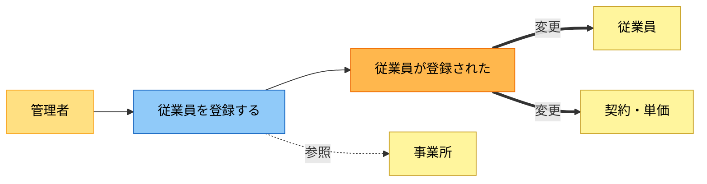

### 勤怠管理領域

#### 従業員が打刻する

**シーン**: 従業員が出勤・退勤のたびにLINEで打刻する。スマホしか持たない現場スタッフが、タイムカードの代わりにLINEで打刻ボタンを押す、自然言語で「9時に出勤しました」と送る、または勤務時間を直接入力する。

- 発生するイベント
  - 打刻された
- 変更エンティティ
  - 勤怠申告

**変更の詳細**: 勤怠申告に、その日の実打刻時間（始業・終業）が事実として記録される。自然言語の場合はシステムが時刻に変換する。勤務時間の直接入力にも対応し、打刻ボタン・自然言語・時間入力の3経路を持つ。丸めはせず1分単位で残す。どの事業所での打刻かもあわせて持つ。

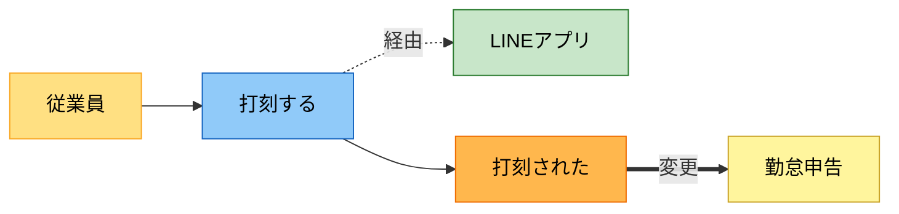

#### 勤怠証跡を取り込む

**シーン**: 紙のタイムカードや手書き出勤簿で運用している現場で、月末などにまとめて画像を取り込むとき。従業員がLINEで送る場合と、管理者が回収してアップロードする場合がある。CSV/Excelファイルでの一括取り込みにも対応する。

- 発生するイベント
  - 証跡が取り込まれた
  - 読み取りエラーが発生した
- 参照エンティティ
  - 事業所
- 変更エンティティ
  - 勤怠証跡
  - 勤怠申告（OCRで読み取れた分は申告の下書きにもなる）

**変更の詳細**: タイムカード画像やCSV/Excelファイルを勤怠証跡として保存する。OCRが画像から日付ごとの打刻時刻を読み取れた場合は、勤怠申告の下書きも自動生成する。読み取れなかった日付の行はエラーとして残り、薄い赤背景・赤枠で示される。証跡だけ存在し自己申告がないケースもある。

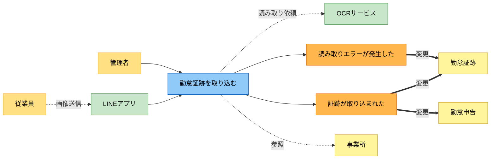

#### 打刻を手修正する

**シーン**: 退勤の押し忘れ、休憩が取れなかった、OCRが読めなかったなど、事実と記録がずれたとき。チェック者が画面で気づいて直す。

- 発生するイベント
  - 打刻が手修正された
- 変更エンティティ
  - 勤怠申告

**変更の詳細**: 管理者が勤怠申告の時刻や休憩時間を手で上書きする。上書きした行は黄色くハイライトされ、手修正された事実が残る。休憩を0分や30分に減らすと、その分が労働時間として計算される。

#### 勤怠を確認し承認を要求する

**シーン**: 締めの前に、従業員が自分の今月の勤怠をLINEで見て、内容が正しければ承認を求める。管理者は要求を受けて中身を確認し、問題なければ承認する。

- 発生するイベント
  - 勤怠の承認が要求された
  - 勤怠が承認された
- 参照エンティティ
  - 勤怠申告
- 変更エンティティ
  - 勤怠申告

**変更の詳細**: 従業員の承認要求で勤怠申告が承認待ちになる。管理者は勤怠申告と勤怠証跡の両方を突合して確認し、整合していれば承認、問題があれば差し戻す。証跡がない場合は申告だけで判断し、申告がなく証跡だけの場合は証跡から申告を起こしてもらう。差し戻すと記録済みに戻り、再度修正・確認する。

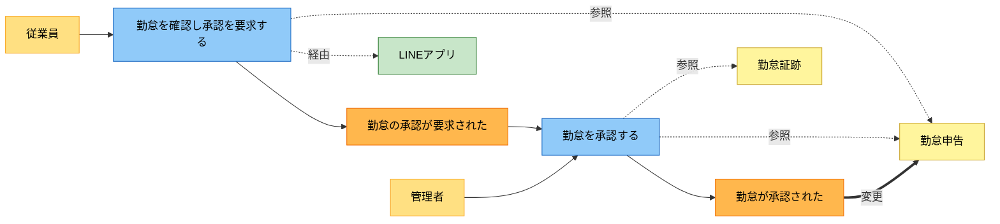

#### 労働時間を5区分へ集計する

**シーン**: 打刻が承認されたあと、給与計算の前提として労働時間を集計する。担当者が明示的に操作するというより、確認や試算のたびに裏で走る。

- 発生するイベント
  - 労働時間が集計された
- 参照エンティティ
  - 勤怠申告
  - 事業所

**変更の詳細**: 勤怠申告と事業所の勤務条件・休日設定を突合し、基本・残業（法定外）・朝残業・深夜・休日（法定／所定）の5区分に振り分ける。事業所ごとに集計するため、複数事業所で働く人は事業所別に時間がまとまる。週40時間・月60時間超の割増を事業所横断で合算するかは論点。

### 月次給与領域

#### 手当を設定する

**シーン**: 役職手当・資格手当・交通費など、その月の手当を登録するとき。毎月固定のものも、その月だけのものもある。

- 発生するイベント
  - 手当が設定された
- 変更エンティティ
  - 手当項目

**変更の詳細**: 手当の条件は派遣元（会社）単位で統一し、従業員ごとに個別設定しない。手当項目に種類・金額・課税区分を持つ。名称に「通勤」を含むと自動で非課税と判定され、所得税の計算ベースから外れる。任意手当は課税／非課税を手動で切り替えられる。非課税の上限判定は未対応で、現状は全額が非課税になる。

#### 給与を試算する

**シーン**: 締めのあと、確定の前に金額を見ておきたいとき。「前月と同様」ボタンで前月の実績を取り込み、当月との差を見ながら確認する。

- 発生するイベント
  - 給与が試算された
- 参照エンティティ
  - 勤怠申告（集計済み）
  - 従業員
  - 契約・単価
  - 手当項目
  - 法定料率
  - 雇用保険料率

**変更の詳細**: 集計済みの勤怠・契約・手当・各種料率から、総支給・社保・税・手取りを計算する。確定はせず何度でも試算し直せる。試算画面と確定画面は同じ計算を使い、金額がずれないようにする。

#### 従業員に給与を送付して確認を取る

**シーン**: 試算の結果を管理者が確認した後、確定前に従業員本人にLINEで給与明細を送って内容を確認してもらうとき。

- 発生するイベント
  - 給与明細が送付された
  - 従業員が確認した
  - 従業員が問題を指摘した
- 参照エンティティ
  - 月次給与（試算済み）
- 変更エンティティ
  - 月次給与

**変更の詳細**: 試算済みの月次給与からPDFを生成し、パスワード付きでLINEへ送付する。従業員が確認ボタンを押すと確認済みになる。押さなかった場合は送付後○日で自動確定する。問題がある場合は従業員が指摘し、管理者と調整して再試算に戻る。

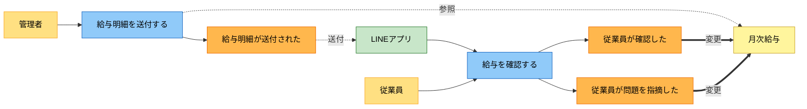

#### 給与を確定する

**シーン**: 従業員の確認（または自動確定期限の経過）を経て、その月の給与を固定するとき。個人単位の確定と一括確定の両方に対応する。

- 発生するイベント
  - 給与が確定された
- 参照エンティティ
  - 勤怠申告（集計済み）
  - 従業員・契約・手当・各種料率
- 変更エンティティ
  - 月次給与（確定スナップショット）

**変更の詳細**: 確定は単なるフラグではなく、その時点の適用料率・金額・控除内訳・社保控除後給与・源泉所得税額を保存する操作として定義する。確定後はフォームがグレーアウトしロックされる。翌月にマスタや料率を変えても過去の確定分は再計算されない。賞与が前月のこれらを参照するため、保存項目が不足すると賞与計算が成立しない。

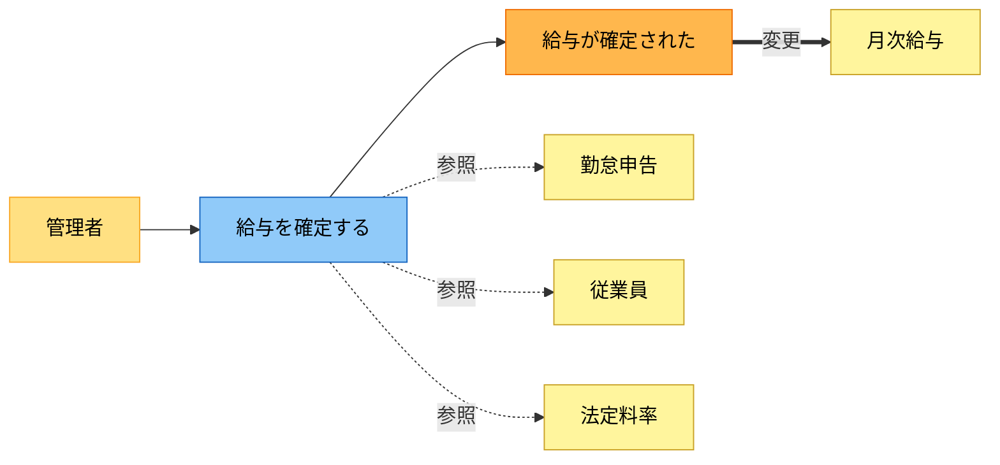

#### 給与明細を配信する

**シーン**: 確定したあと、従業員に明細を届けるとき。確定済みの人だけ解禁される。

- 発生するイベント
  - 明細が配信された
- 参照エンティティ
  - 月次給与（確定済み）

**変更の詳細**: 確定済みの月次給与から明細PDFを生成し、LINEで従業員へ配信する（アプリで閲覧可能）。PDFのファイル名は「[従業員名] 給与明細 [年月].pdf」。明細そのものは確定済みデータの写しで、新たな情報の変更は伴わない。

### 賞与領域

#### 賞与回を作成する

**シーン**: 夏季・冬季賞与など、賞与を支給する回を立ち上げるとき。月次給与とは別に扱う。

- 発生するイベント
  - 賞与回が作成された
- 変更エンティティ
  - 賞与回

**変更の詳細**: 賞与回に支給日と名称を持つ。これを単位に、従業員別の賞与結果がぶら下がる。

#### 賞与を計算する

**シーン**: 賞与回に対して従業員ごとの賞与額を入れ、社保と源泉を計算するとき。

- 発生するイベント
  - 賞与が計算された
- 参照エンティティ
  - 前月の月次給与（社保控除後給与・源泉所得税額）
  - 従業員
  - 法定料率
- 変更エンティティ
  - 賞与結果

**変更の詳細**: 標準賞与額（賞与額の1,000円未満切捨て）を基礎に、健保・介護・厚年・支援金を労使折半で、雇用保険は支給額そのもので計算する。源泉は前月の月次給与（社保控除後）から算出率表を引いて求める。年度累計573万円・1回150万円の上限がある。結果は賞与結果に記録する。

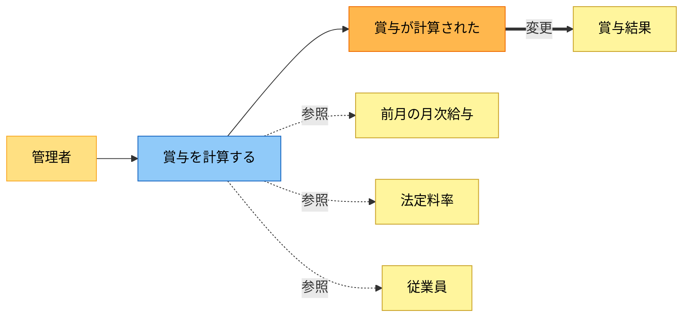

#### 賞与を確定する・明細を出す

**シーン**: 賞与の内容を確認し終え、固定して明細を出すとき。

- 発生するイベント
  - 賞与が確定された
  - 賞与明細が出力された
- 変更エンティティ
  - 賞与結果

**変更の詳細**: 賞与結果を、その時点の料率・金額で固定する。上限到達時は「上限到達によりこの部分は控除されない」旨を明細・画面に出す。前月の月次給与がロック済みであることを確定の前提にするかは論点。

### 締め・士業連携領域

#### 月次給与を締める

**シーン**: 月の給与を全従業員分そろえて締めるとき。未確定の人が残っていないか確認する。

- 発生するイベント
  - 月次給与が締められた
- 参照エンティティ
  - 月次給与

**変更の詳細**: 当月の月次給与を一覧する。未確定の従業員がいれば画面上部に警告ラベルを出す。締め自体は確定済みデータの確認で、金額の変更は伴わない。

#### 士業へ共有する

**シーン**: 締めのあと、会計士・社労士へ給与一覧を渡すとき、または会計ソフトへ取り込むとき。

- 発生するイベント
  - 給与一覧が出力された
  - 士業へ共有された
- 参照エンティティ
  - 月次給与

**変更の詳細**: 月次給与からExcel、CSV、PDFの3形式で出力する。給与計算ソフトにとりこめる必要があり、PDFはOCRで会計ソフトへ読み込む用途も想定する。ファイル名は「[会社名] 給与一覧 [年月].[拡張子]」。将来は、部門ごとの人件費配賦や社保の会社／本人負担の内訳まで出せると、士業の月末の手作業が消える。

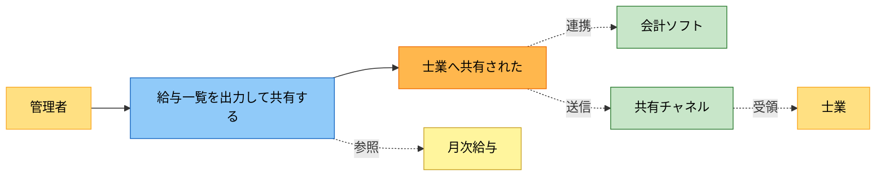

## 4. 状態モデル

### 勤怠申告

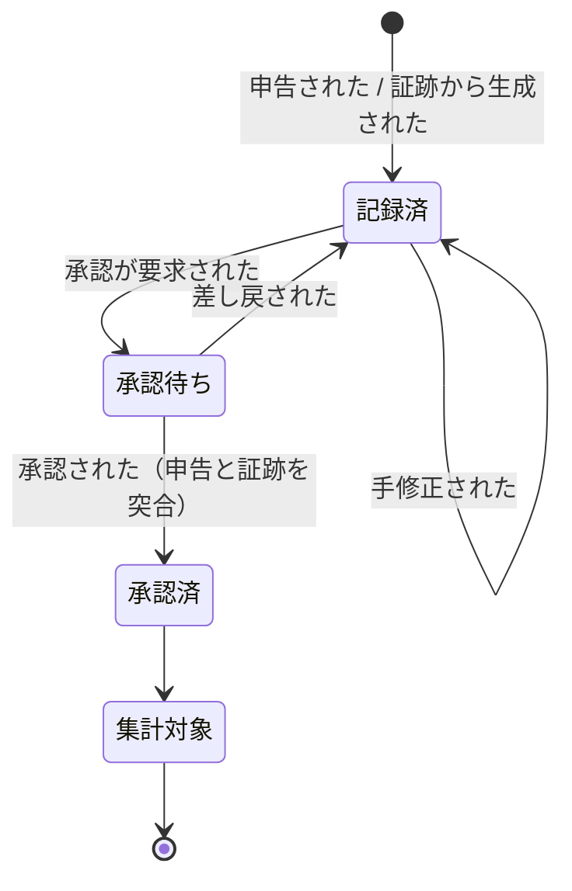

勤怠証跡（タイムカード画像・CSV/Excel等）は独立して保存され、承認時に申告と突合する。証跡だけ存在し申告がないケースや、申告だけで証跡がないケースもある。

### 月次給与

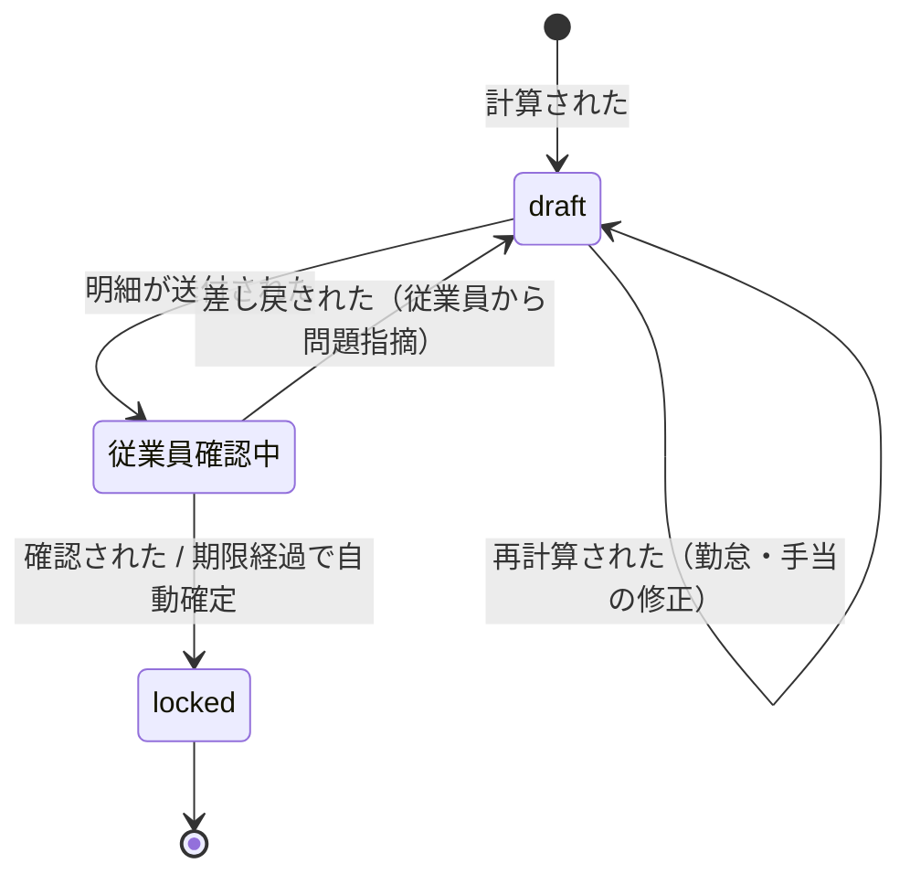

確定（locked）は単なるフラグではなく、その時点の適用料率・金額・控除内訳・社保控除後給与・源泉所得税額を保存する操作。賞与が前月のこれらを参照するため、保存項目が不足すると賞与計算が成立しない。

### 賞与結果

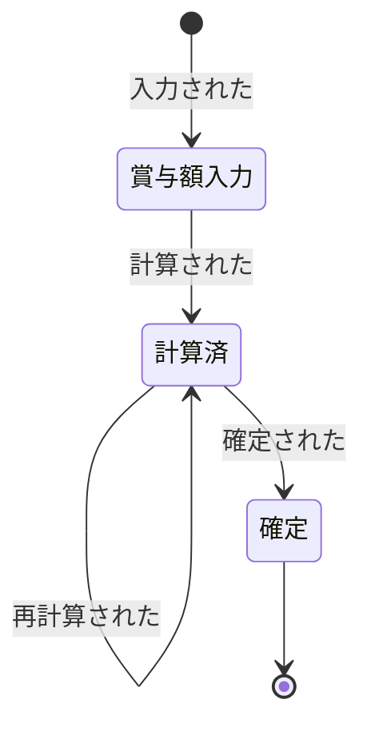

## 5. 利用シーン

| シーン | 条件 | 概要 |
| --- | --- | --- |
| 従業員のLINE打刻 | 従業員がLINEを使う | 打刻・画像送信し、自分の勤怠を確認して承認を要求する |
| 通常の月次給与 | 打刻が正常に取り込める | 取込→承認→集計→試算→従業員確認→確定→明細配信が一度で通る |
| 従業員の給与明細確認 | 試算後に明細を送付 | LINEでPW付き明細を送付し、確認ボタンで承認。未押下は○日で自動確定 |
| 読み取りエラーの修正 | OCRが一部行を読めない | エラー行だけ色付き警告。手入力で消し込む |
| 打刻忘れの修正 | 退勤打刻なし等 | 担当者が時刻を上書き。行が色付きで残る |
| ヘルプ出勤 | 複数事業所・単価違い | 事業所ごとに時間を集計し、別単価で合算する |
| 介護保険の到達 | 40歳到達月 | その月から介護保険料の控除を自動で始める |
| 賞与支給 | 賞与回を作成 | 前月の月次給与を参照して源泉を出す |
| 月途中の入退社 | 入社・退職が月中 | 日割り・退職月の社保。V1未対応 |
| 育休・産休 | 休業中 | 社保免除。V1未対応 |

- 従業員のLINE打刻
  - 従業員がLINEで打刻、または自然言語で勤務を伝える。タイムカード画像を送ることもできる
  - 自分の勤怠を確認し、問題なければ承認を要求する。管理者が承認すると集計に進む
  - LINEから勤務時間を直接入力することもできる
- 読み取りエラーの修正
  - エラー行を薄い赤背景・赤枠で示す
  - タップで手入力ビューを開き、時刻を入れるとエラーが解除される
- ヘルプ出勤
  - 「A店舗は時給1,200円、B店舗は1,300円」のように事業所ごとに単価が変わる
  - 打刻場所ごとに労働時間を集計し、それぞれの単価で計算して合算する
  - 週40時間・月60時間超の割増を、事業所をまたいで合算するかは要確認
- 賞与支給
  - 賞与の源泉は前月の月次給与（社保控除後）を参照する
  - 前月が未確定、前職分しかない、賞与額が前月給与の10倍超などのケースの扱いは要確認

## 6. 論点・確認事項

要求として固めきれていない点。会計士・八鍬さんへの確認待ちを含む。未確定項目は決まるまで「未確定」と明示してエンジニアに渡さない。端数処理の揺れは実装品質の話で、要件層ではなくQAバックログへ回す。

| 論点 | 状態 |
| --- | --- |
| 所定休日労働の一律1.25倍（週40時間以内部分の割増要否） | 会計士確認待ち |
| 残業手当の手入力と勤怠からの自動割増の二重計上をどう防ぐか | 運用方針未定 |
| 雇用保険の事業区分（建設業等の料率差）をマスタに持たせるか | 八鍬確認待ち |
| 住民税の6月と7月以降の月割（特別徴収の初月調整） | 未対応・要否確認 |
| 所得税の扶養人数・乙欄・令和8新設「源泉控除対象親族」の扱い | 未対応 |
| 標準報酬月額の決定（定時決定・随時改定）をマスタ手入力前提でよいか | 要確認 |
| 健保料率の事業所別適用と本社一括適用の切替 | 設計済み・未実装 |
| 通勤手当の非課税上限（公共交通機関 月15万円等）の判定 | 未対応 |
| 複数事業所合算時の週40時間・月60時間超の判定単位 | 要確認 |
| 月途中入退社の日割り、退職月の社保 | V1未対応 |
| 育休・産休中の社保免除 | V1未対応 |
| 賞与の確定は前月月次のロックを必須にするか | 要確認 |
| 給与明細の従業員確認の自動確定期限（○日） | 未定 |
| 給与明細LINE送付時のパスワード保護の仕様 | 未定 |

### フロー跨ぎで確認が必要なデータモデル課題

複数のフロー・複数のバグの根を同時に押さえる数個のデータモデル決定がある。コード監査で挙がった課題群は、おおむね以下の4クラスタに収まる。

1. **標準報酬月額の履歴化** — 標準報酬月額を「従業員 × 適用期間」の履歴で持つ。単一値だと、随時改定・定時決定・退職月の資格喪失・40歳到達と月変が同月・等級上限チェックがすべて破綻する。履歴化で一括して解ける
2. **労働時間の集計スコープを従業員単位へ** — 労働時間の集計スコープを「職場単位」から「従業員（同一使用者）単位」に変える。週40時間超・月60時間超の職場横断未合算、賞与の都道府県が月次と食い違う問題が揃う。労基法の「同一の使用者に対する」判定単位をモデルに反映する
3. **スナップショットの保存項目を増やす** — 最低でも「社保控除後給与」「源泉所得税額」「上限到達フラグ」「適用料率内訳」を保存する。賞与の前月参照と、確定後の明細再現に必要。draftの混入防止も同時に解決する
4. **従業員フラグの整備** — 雇用保険加入の有無、育休・産休中の社保免除、退職日。フラグの有無で控除が出る／出ないが決まる入口になる

## 7. ユースケース

各業務のユースケースを、ロバストネス図と画面モックアップで記述する。

ロバストネス図の色分け:

- **画面**（青）— ユーザーが操作する画面
- **処理**（緑）— 画面からの入力を受けて実行する処理
- **イベント**（橙）— 処理の結果として起きた事実
- **エンティティ**（薄黄）— 変更される情報
- **ビュー**（紫）— 参照される表示用の情報

### 勤怠管理

#### UC-01: 従業員がLINEで打刻する

**アクター**: 従業員
**前提**: LINE連携が完了している

**基本フロー**:

1. 従業員がLINEのリッチメニューから「出勤」または「退勤」をタップする
2. システムが現在時刻で勤怠申告を記録する
3. 記録結果をLINEに返信する

**代替フロー**:

- A1: 自然言語で「9時に出勤しました」と送る → システムが時刻を解釈して記録
- A2: 勤務時間を直接入力する → 始業・終業を指定して記録
- A3: 申告のみで証跡はない（LINEの打刻メッセージ自体が記録になる）

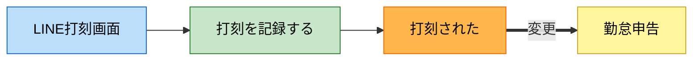

**画面モックアップ: LINE打刻**

| 要素 | 内容 |
| --- | --- |
| Bot名 | 給与管理Bot |
| リッチメニュー | `[出勤]` `[退勤]` `[確認]` |
| 入力方法 | ボタンタップ / 自然言語テキスト / 勤務時間の直接入力 |

従業員の送信例と Bot の応答:

| 従業員 | Bot |
| --- | --- |
| （出勤ボタン） | ✓ 6/19(木) 9:00 出勤を記録しました |
| 9時に出勤しました | ✓ 6/19(木) 9:00 出勤を記録しました |
| 今日は10:00-19:00で勤務 | ✓ 6/19(木) 10:00-19:00 を記録しました |
| きのう休みました | ✓ 6/18(水) 欠勤を記録しました |
| あさって出勤 | 時刻を教えてください（例: 9:00-18:00） |

#### UC-02: 勤怠証跡を取り込む

**アクター**: 従業員 / 管理者
**前提**: 事業所が登録されている

**基本フロー**:

1. 従業員がLINEでタイムカード画像を送る、または管理者がWeb画面からアップロードする
2. OCRが画像を読み取り、日付ごとの打刻時刻を抽出する
3. 画像を勤怠証跡として保存し、読み取り結果を勤怠申告の下書きとして生成する

**代替フロー**:

- A1: CSV/Excelファイルをアップロード → OCRを経由せず直接取り込む
- A2: OCRが一部の行を読み取れない → 読み取れた行だけ申告の下書きを作り、エラー行を警告表示
- A3: 証跡だけ保存して申告は別途従業員が行う

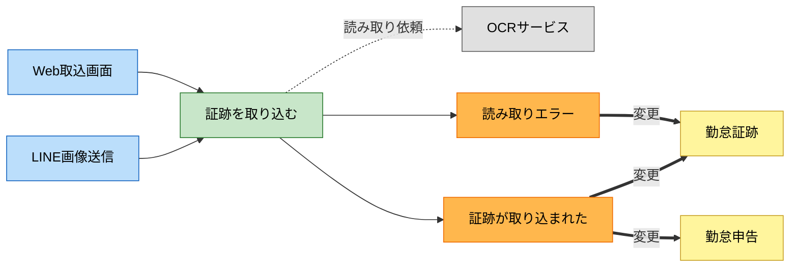

**画面モックアップ: Web証跡取込**

| 要素 | 内容 |
| --- | --- |
| 対象選択 | 事業所ドロップダウン、対象年月 |
| アップロード | 画像ファイル / CSV / Excel をドラッグ&ドロップ |
| プレビュー | OCR読み取り結果を日付×従業員のグリッドで表示 |
| エラー表示 | 読み取れなかった行を赤背景で強調 |
| アクション | `[取り込む]` `[キャンセル]` |

取込結果プレビュー:

| 日付 | 従業員 | 始業 | 終業 | 状態 |
| --- | --- | --- | --- | --- |
| 6/2 | 田中太郎 | 9:00 | 18:00 | ✓ 読取済 |
| 6/3 | 田中太郎 | 9:15 | — | ⚠ 終業読取エラー |
| 6/2 | 鈴木花子 | 8:30 | 17:30 | ✓ 読取済 |

#### UC-03: 勤怠を承認する

**アクター**: 従業員 → 管理者
**前提**: 勤怠申告が記録済み

**基本フロー**:

1. 従業員がLINEで自分の今月の勤怠を確認する
2. 内容に問題なければ承認を要求する
3. 管理者がWeb画面で勤怠申告と勤怠証跡を突合して確認する
4. 整合していれば承認し、集計へ進める

**代替フロー**:

- A1: 申告だけで証跡がない → 管理者が申告のみで判断する
- A2: 証跡だけで申告がない → 管理者が従業員に申告を出すよう差し戻す
- A3: 申告と証跡が食い違う → 差し戻して修正を求める

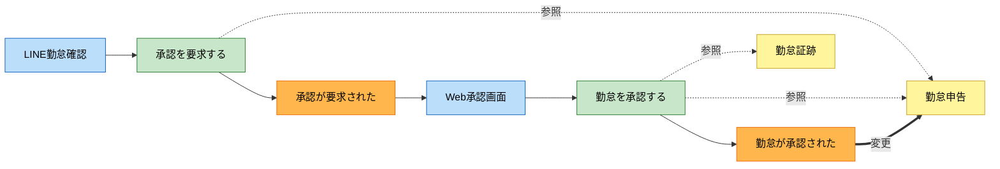

**画面モックアップ: LINE勤怠確認**

従業員が「確認」ボタンを押したときに表示:

| 日付 | 始業 | 終業 | 休憩 | 実働 |
| --- | --- | --- | --- | --- |
| 6/2(月) | 9:00 | 18:00 | 60分 | 8:00 |
| 6/3(火) | 9:15 | 19:30 | 60分 | 9:15 |
| 6/4(水) | — | — | — | 欠勤 |
| ... | | | | |
| 合計 | | | | 152:30 |

`[承認を要求する]` `[修正を依頼する]`

**画面モックアップ: Web承認画面**

| 要素 | 内容 |
| --- | --- |
| フィルタ | 事業所、対象年月、承認状態（未承認/承認済み） |
| 一覧 | 従業員ごとの勤怠サマリ（実働合計、残業、承認状態） |
| 詳細 | 従業員を選ぶと日別の申告と証跡を横並びで表示 |
| 突合表示 | 申告と証跡の食い違いを黄色ハイライト |
| アクション | `[承認]` `[差し戻し]` |

申告と証跡の突合ビュー（従業員を選択後）:

| 日付 | 申告: 始業 | 申告: 終業 | 証跡: 始業 | 証跡: 終業 | 状態 |
| --- | --- | --- | --- | --- | --- |
| 6/2 | 9:00 | 18:00 | 9:00 | 18:00 | ✓ 一致 |
| 6/3 | 9:00 | 19:30 | 9:15 | 19:30 | ⚠ 始業ずれ |
| 6/4 | — | — | 9:00 | 17:00 | ⚠ 申告なし |

#### UC-04: 給与を試算する

**アクター**: 管理者
**前提**: 勤怠が承認済み、マスタ（従業員・契約・料率・手当）が設定済み

**基本フロー**:

1. 管理者がWeb画面で対象月の給与計算を実行する
2. 承認済みの勤怠申告を5区分に集計し、契約・手当・各種料率から総支給・控除・手取りを計算する
3. 結果を従業員一覧で表示する。前月との差額も並べて出す

**代替フロー**:

- A1: 「前月と同様」ボタンで前月の手当をコピーして計算
- A2: 未承認の勤怠がある → 警告を表示し、その従業員は試算対象外
- A3: 手当や単価を変更して再試算 → 何度でも繰り返せる

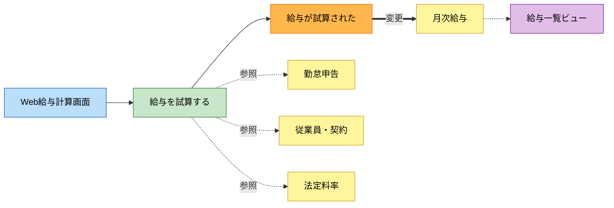

**画面モックアップ: Web給与計算**

ヘッダ:

| 要素 | 内容 |
| --- | --- |
| 対象月 | 2026年6月 |
| アクション | `[計算実行]` `[前月と同様]` |
| 警告 | 未承認の勤怠がある従業員: 2名 |

給与一覧:

| 従業員 | 実働 | 残業 | 基本給 | 手当 | 総支給 | 社保 | 税 | 手取り | 前月差 | 状態 |
| --- | --- | --- | --- | --- | --- | --- | --- | --- | --- | --- |
| 田中太郎 | 160:00 | 12:00 | 240,000 | 15,000 | 273,000 | 38,500 | 5,600 | 228,900 | +3,200 | draft |
| 鈴木花子 | 152:30 | 4:30 | 198,000 | 10,000 | 214,600 | 30,200 | 4,100 | 180,300 | -1,800 | draft |

従業員を選択すると計算内訳を展開:

| 項目 | 金額 | 備考 |
| --- | --- | --- |
| 基本給（時給1,500円 × 160h） | 240,000 | |
| 残業（時給1,500円 × 1.25 × 12h） | 22,500 | |
| 深夜（時給1,500円 × 0.25 × 0h） | 0 | |
| 通勤手当 | 15,000 | 非課税 |
| 総支給 | 277,500 | |
| 健保（9.87% 折半） | 13,700 | |
| 厚年（18.30% 折半） | 25,400 | |
| 雇用（0.70%） | 1,900 | |
| 所得税 | 5,600 | 甲欄・扶養0人 |
| 住民税 | 8,500 | |
| 差引支給額 | 222,400 | |

#### UC-05: 従業員に給与を送付して確認を取る

**アクター**: 管理者 → 従業員
**前提**: 給与が試算済み（draft状態）

**基本フロー**:

1. 管理者が試算結果を確認し、「従業員に送付」を実行する
2. 各従業員にLINEでパスワード付き明細PDFが届く
3. 従業員が内容を確認し、確認ボタンを押す
4. 月次給与の状態が「従業員確認中」から「確認済み」に変わる

**代替フロー**:

- A1: 従業員が問題を指摘 → 管理者に通知され、調整後に再試算
- A2: 送付後○日以内に確認ボタンが押されない → 自動確定
- A3: 一括送付で全従業員に同時に送る

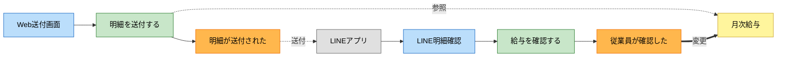

**画面モックアップ: LINE明細確認**

従業員に届くメッセージ:

| 要素 | 内容 |
| --- | --- |
| タイトル | 2026年6月 給与明細 |
| 本文 | 給与明細をお送りします。内容をご確認ください |
| 添付 | 給与明細PDF（パスワード付き） |
| ボタン | `[内容を確認しました]` `[問題があります]` |
| 注記 | ○日以内に確認がない場合は自動確定します |

「問題があります」を押した場合:

| 要素 | 内容 |
| --- | --- |
| 入力欄 | 問題の内容をテキストで入力 |
| 送信先 | 管理者に通知が届く |
